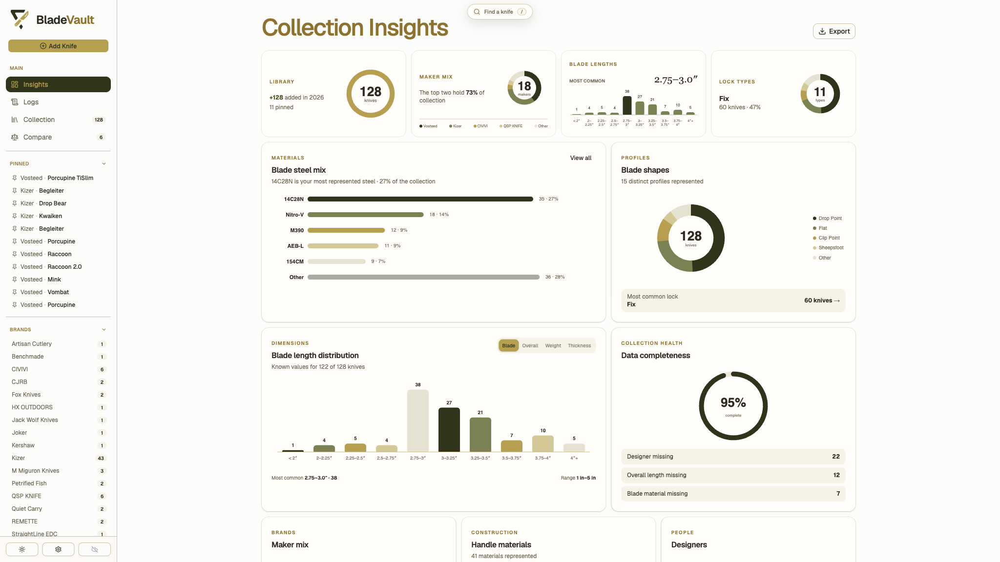
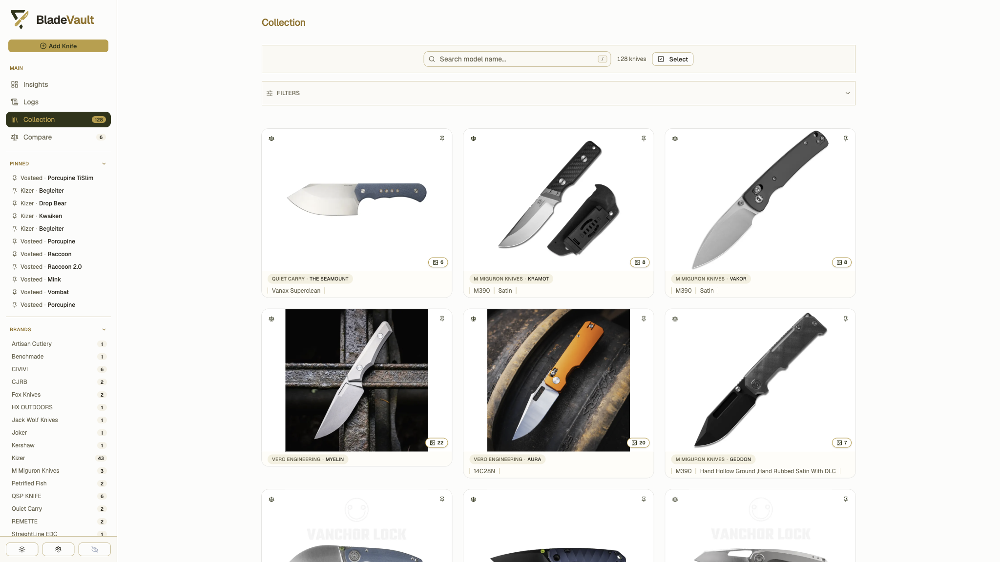
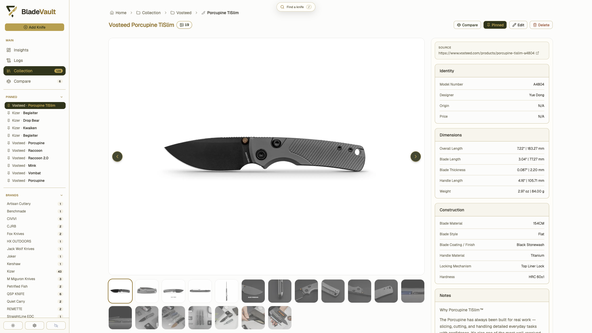

# BladeVault Web

[](https://nextjs.org/)
[](https://react.dev/)
[](https://www.typescriptlang.org/)
[](https://tailwindcss.com/)
[](https://vercel.com/)

Promo website for [BladeVault](https://github.com/dedkola/bladevault), the local-first desktop knife collection manager. This repository contains the marketing site and screenshot-driven product presentation, not the main app codebase.

## About

The site is built with Next.js 16, React 19, TypeScript, and Tailwind CSS 4. It focuses on presenting the BladeVault product clearly through editorial sections, a sidebar-first desktop layout, and app screenshots sourced from the main repository.

If you need the application itself, use the main [BladeVault repo](https://github.com/dedkola/bladevault).

## Product Screenshots

<div align="center">

  
  <p><sub>Insights — patterns, dimensions, materials, and collection health</sub></p>

  
  <p><sub>Collection — search, filter, pin, and browse every knife</sub></p>

  
  <p><sub>Detail view — specifications, notes, and image gallery</sub></p>

  
  <p><sub>Compare — the details that matter, side by side</sub></p>

  
  <p><sub>Add knife — import a product URL or enter it yourself</sub></p>

</div>

## Project Structure

- `app/` - Next.js routes, layout, and global styles
- `components/sections/` - homepage content blocks
- `components/site/` - shared site chrome such as header, footer, and sidebar
- `components/ui/` - reusable UI primitives
- `public/screenshots/` - BladeVault product screenshots used in the promo site

## Development

This project uses [pnpm](https://pnpm.io/) 11. Install dependencies and start the development server with:

```bash
pnpm install
pnpm dev
```

Run the quality gates with:

```bash
pnpm lint
pnpm typecheck
pnpm build
```

## Assets

Screenshots and product imagery are derived from the main [BladeVault](https://github.com/dedkola/bladevault) repository.
