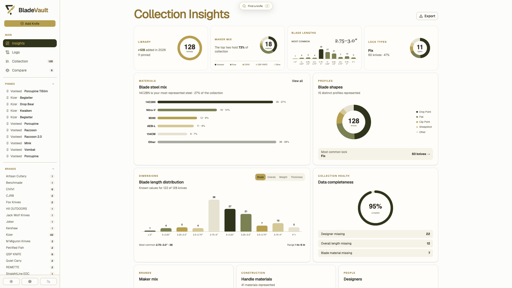
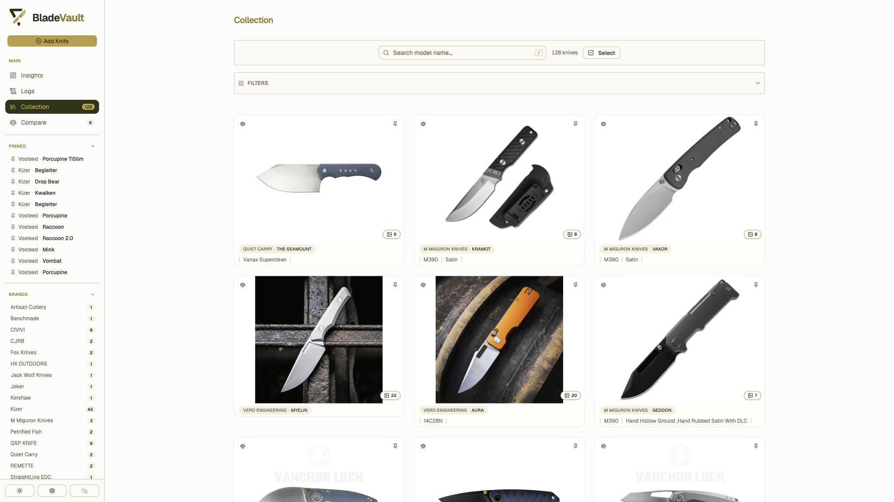
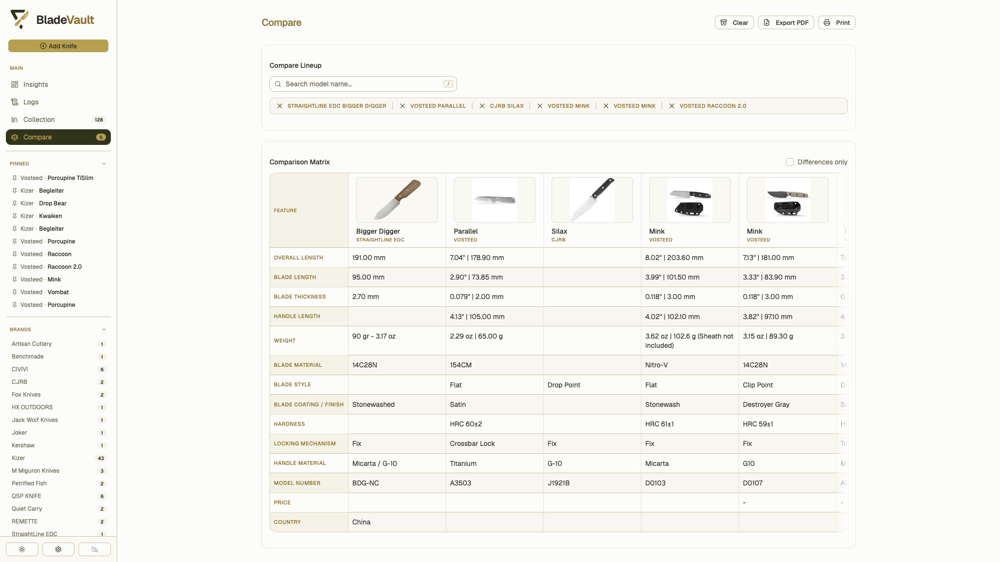
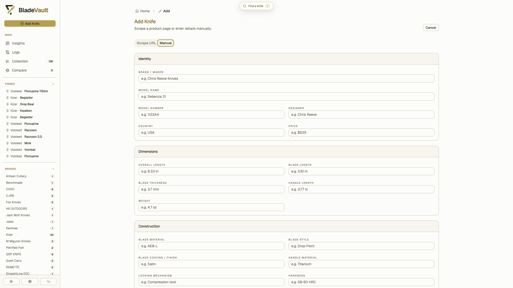

# BladeVault Web

[](https://nextjs.org/)
[](https://react.dev/)
[](https://www.typescriptlang.org/)
[](https://tailwindcss.com/)
[](https://vercel.com/)

Promo website for [BladeVault](https://github.com/dedkola/bladevault), the local-first desktop knife collection manager. This repository contains the marketing site and screenshot-driven product presentation, not the main app codebase.

## About

The site is built with Next.js 16, React 19, TypeScript, and Tailwind CSS 4. The homepage presents BladeVault through a shared site header, spacious editorial sections, and app screenshots sourced from the main repository. The `/whats-new` release notes page includes a compact promotional sidebar.

If you need the application itself, use the main [BladeVault repo](https://github.com/dedkola/bladevault).

## Product Screenshots

<div align="center">

  
  <p><sub>Insights — patterns, dimensions, materials, and collection health</sub></p>

  
  <p><sub>Collection — search, filter, pin, and browse every knife</sub></p>

  
  <p><sub>Detail view — specifications, notes, and image gallery</sub></p>

  
  <p><sub>Compare — the details that matter, side by side</sub></p>

  
  <p><sub>Add knife — import a product URL or enter it yourself</sub></p>

</div>

## Project Structure

- `app/` - Next.js routes, layout, and global styles
- `app/page.tsx` - homepage assembled from reusable sections
- `app/whats-new/page.tsx` - curated BladeVault release notes
- `components/sections/` - homepage content blocks
- `components/site/` - shared site chrome such as header, footer, and sidebar
- `components/ui/` - reusable UI primitives
- `lib/site.ts` - shared site metadata, download links, screenshot paths, and video configuration
- `public/screenshots/` - BladeVault product screenshots used in the promo site

## Development

Use Node.js 24 (see `.nvmrc`) and [pnpm](https://pnpm.io/) 11. The package manager is pinned to `pnpm@11.13.1` in `package.json`. Install dependencies and start the development server with:

```bash
pnpm install
pnpm dev
```

Run the quality gates with:

```bash
pnpm lint
pnpm typecheck
pnpm build
```

Serve the production build with `pnpm start`. Use `pnpm format` to format the repository with Prettier; this command writes changes to files.

## Configuration

URL configuration is optional. To override the defaults locally, copy `.env.example` to `.env.local` and set the appropriate values before starting the development server or building the site.

| Setting                                                    | Resolution order                                                              | Default                                                                        |
| ---------------------------------------------------------- | ----------------------------------------------------------------------------- | ------------------------------------------------------------------------------ |
| Site URL for canonical links, social metadata, and sitemap | `NEXT_PUBLIC_SITE_URL`, then `SITE_URL`, then `VERCEL_PROJECT_PRODUCTION_URL` | `https://bladevault.pro` in production; `http://localhost:3000` in development |
| Base URL for hosted video assets                           | `NEXT_PUBLIC_VIDEO_URL`, then `VIDEO_URL`                                     | `https://video.bladevault.pro`                                                 |

The first defined variable in each row is used. Invalid URLs fall back to the corresponding default. Video files are hosted separately from this repository.

## Assets

Screenshots and product imagery are derived from the main [BladeVault](https://github.com/dedkola/bladevault) repository.
