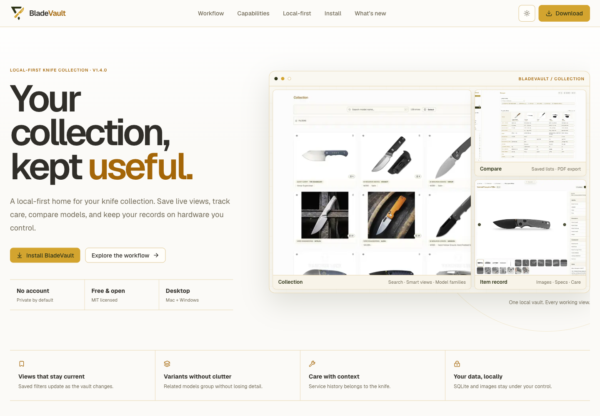
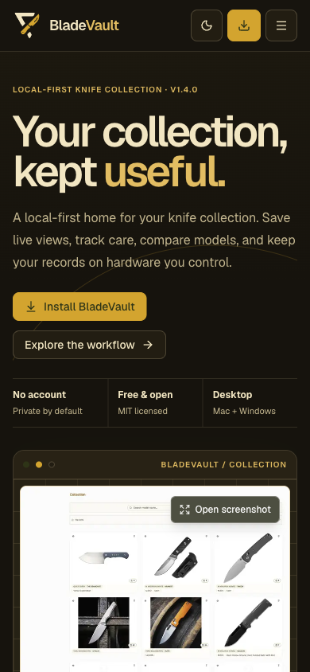
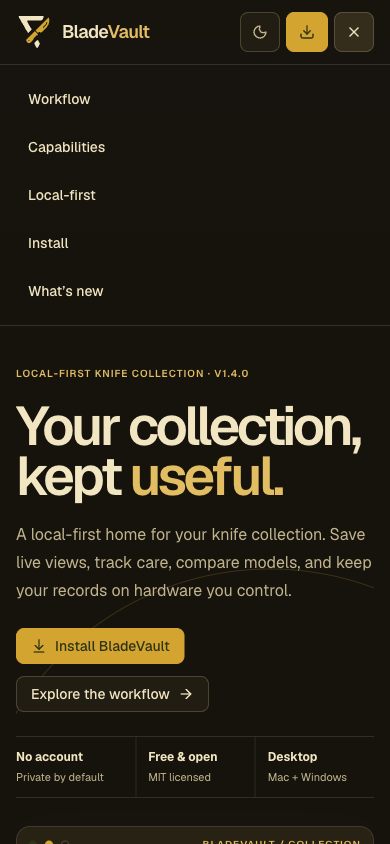
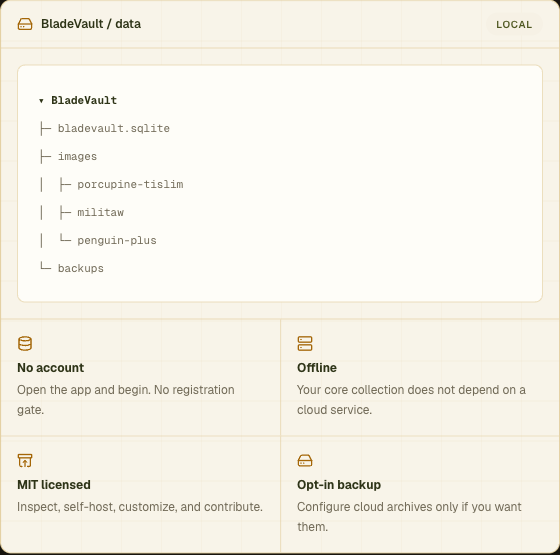

# Homepage polish review

The homepage keeps the existing Geist typography, olive/gold palette, section order, and screenshot enlargement. This update adds mobile navigation, contains keyboard focus inside screenshot dialogs, improves dark-mode contrast, and keeps section anchors clear of the sticky header.

At 390×844, the product preview starts around 565px down the page instead of 832px. Hero captions sit beneath the images, and supporting previews use the full mobile width. Copy now identifies the knife collection manager and covers v1.4.0, saved comparison lists, source-page screenshots, and the optional local app lock.

Validation: Node 24, ESLint, TypeScript, focused Prettier checks, and production build. Browser checks covered 320, 390, 768, 1024, 1440, and 1920px in both themes, menu navigation and dismissal, anchor positioning, dialog Tab/Shift+Tab containment, Escape, backdrop/close-button dismissal, and trigger focus restoration.

